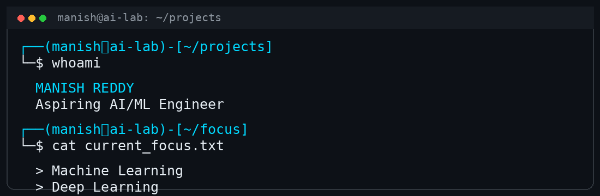

<!-- =========================================================
     HERO BANNER SECTION
     ========================================================= -->

 

  

---

<!-- =========================================================
     ABOUT ME
     ========================================================= -->
## 👋 About Me

<table>
<tr>
<td width="65%" valign="top">

**Aspiring AI/ML Engineer** • B.Tech CSE (2024–2028) at **Vardhaman College of Engineering, Hyderabad** • **CGPA: 9.03/10**

I build practical AI/ML systems — from vulnerability detection using Graph Neural Networks to RAG-based enterprise knowledge assistants and multimodal notification prioritization.

### My focus

- 🧠 **Machine Learning & Deep Learning** — PyTorch, Scikit-learn, neural architectures
- 🤖 **Generative AI & LLMs** — RAG, embeddings, semantic search, local models
- 📝 **NLP & Multimodal AI** — text classification, document understanding
- 🕸️ **Graph ML & Code Intelligence** — code representation, vulnerability detection, GNNs
- 🌐 **AI Application Development** — FastAPI, React, AI-powered services

I practice **DSA** regularly using Python, C++, and Java, and enjoy turning research ideas into working systems.

Open to **AI/ML internships, research collaborations, hackathons, and impactful projects.**

</td>

<td width="35%" align="center" valign="middle">

</td>
</tr>
</table>
---

<!-- =========================================================
     SKILLS & TECHNOLOGIES
     ========================================================= -->
## 🛠️ Skills & Technologies

<b>🧠 AI / Machine Learning</b>

 

`Python` `PyTorch` `Scikit-learn` `NumPy` `Pandas` `Matplotlib` `Transformers` `Sentence-Transformers` `FAISS` `Torch`

<b>🤖 Generative AI / LLMs</b>

 

`LLMs` `RAG` `Embeddings` `Semantic Search` `NLP` `Multimodal AI` `Local LLMs` `Claude API` `Hugging Face` `Vector Databases` `Context-Aware AI`

<b>🕸️ Graph ML / Code Intelligence</b>

 

`Graph Neural Networks` `Graph-based ML` `Code Representation` `Source Code Analysis` `Vulnerability Detection` `NetworkX` `PyTorch Geometric` `PrimeVul Dataset` `Repository-Aware Splitting`

<b>📊 Data Science</b>

 

`NumPy` `Pandas` `Matplotlib` `Data Preprocessing` `Data Cleaning` `Exploratory Data Analysis` `Dataset Validation` `Model Evaluation` `Deduplication`

<b>💻 Programming Languages</b>

 

`Python` `C++` `Java` `C` `SQL` `JavaScript` `TypeScript` `Shell`

<b>🌐 AI Application Development</b>

 

`FastAPI` `React` `Streamlit` `REST APIs` `Python Backend` `HTML` `CSS` `Tailwind CSS` `Vite` `Framer Motion`

<b>🗄️ Databases</b>

 

`MySQL` `SQLite` `FAISS (Vector DB)`

<b>🛠️ Developer Tools</b>

 

`Git` `GitHub` `VS Code` `Jupyter Notebook` `Google Colab` `Linux` `Windows` `Docker` `GitHub Actions`

---

<!-- =========================================================
     FEATURED PROJECTS
     ========================================================= -->
## 🚀 Featured Projects

### 🛡️ CodeSentinel AI
**AI-powered source-code vulnerability detection using Graph Neural Networks**

| | |
|---|---|
| **Problem** | Detect security vulnerabilities in source code at scale |
| **Solution** | Graph-based code representation with GNNs; PrimeVul dataset preprocessing, deduplication, repository-aware splitting, validation |
| **Key Technologies** | `Python` `PyTorch` `PyTorch Geometric` `NetworkX` `GNNs` `Transformers` `PrimeVul` |
| **Repo** | [github.com/manishreddy1767/codesentinel-ai](https://github.com/manishreddy1767/codesentinel-ai) |

---

### 🧠 PingSense
**AI-powered message & notification prioritization system**

| | |
|---|---|
| **Problem** | Reduce notification overload by intelligently classifying message urgency |
| **Solution** | Multimodal AI pipeline: text classification, semantic embeddings, confidence scoring, contextual understanding, intelligent routing |
| **Key Technologies** | `Python` `Streamlit` `PyTorch` `Sentence-Transformers` `FAISS` `Scikit-learn` `Claude API` `Pandas` `Matplotlib` |
| **Repo** | [github.com/manishreddy1767/PingSense](https://github.com/manishreddy1767/PingSense) |

---

### 📚 AI Company Brain
**Private/local RAG-based enterprise knowledge assistant**

| | |
|---|---|
| **Problem** | Enable secure, citation-backed Q&A over organizational documents |
| **Solution** | Full-stack RAG system: document ingestion, embedding generation, semantic search, local LLM inference, role-based access, source citations |
| **Key Technologies** | `FastAPI` `React` `RAG` `LLMs` `Embeddings` `Semantic Search` `Vector DB` `Tailwind CSS` `Vite` |
| **Repo** | [github.com/manishreddy1767/AI-COMPANY-BRAIN](https://github.com/manishreddy1767/AI-COMPANY-BRAIN) |

---

### 🎟️ Event Ticketing System
**Full-stack event booking platform**

| | |
|---|---|
| **Problem** | End-to-end event management with secure ticketing |
| **Solution** | Authentication, QR-based digital tickets, event management, analytics dashboard |
| **Key Technologies** | `Node.js` `Express` `EJS` `MongoDB` `JavaScript` |
| **Repo** | [github.com/manishreddy1767/event-ticketing-system](https://github.com/manishreddy1767/event-ticketing-system) |

---

<!-- =========================================================
     DSA / PROBLEM SOLVING
     ========================================================= -->
## 🧩 DSA & Problem Solving

<b>📈 LeetCode Practice</b> — 376+ Solutions

 

**Languages:** `Python` `C++` `Java`

**Topics Covered:**
- Arrays & Hash Tables (60+)
- Two Pointers & Sliding Window (25+)
- Binary Search (7+)
- Linked Lists (7+)
- Dynamic Programming (7+)
- Strings (20+)
- Trees & Graphs
- Greedy, Math, Bit Manipulation, Game Theory

**Repo:** [github.com/manishreddy1767/Leetcode-Solutions](https://github.com/manishreddy1767/Leetcode-Solutions)

---

<!-- =========================================================
     CURRENTLY EXPLORING
     ========================================================= -->
## 🚀 Currently Exploring

`Machine Learning` `Deep Learning` `Generative AI` `LLM Applications` `RAG Systems` `NLP` `Multimodal AI` `Graph Neural Networks` `AI-Powered Developer Tools` `DSA & Problem Solving` `Agentic AI` `Code Intelligence`

---

<!-- =========================================================
     GITHUB CONTRIBUTION SNAKE
     ========================================================= -->
## 🐍 Contribution Activity

<b>How this works</b>

 

Generated automatically via **GitHub Actions** — runs daily, commits the updated SVG to the `output` branch, and renders here via raw GitHub URL. No external APIs, no broken images.

---

<!-- =========================================================
     GITHUB STATS (RELIABLE, REPO-HOSTED)
     ========================================================= -->
## 📊 GitHub Overview

---

<!-- =========================================================
     FUN / INTERACTIVE ELEMENT
     ========================================================= -->
## 🎮 Terminal

 

<!-- =========================================================
     FOOTER
     ========================================================= -->

---

### 🤝 Let's Connect

  

📍 **Hyderabad, India** 🇮🇳

---

**Building today. Learning continuously. Engineering the future with AI.**

